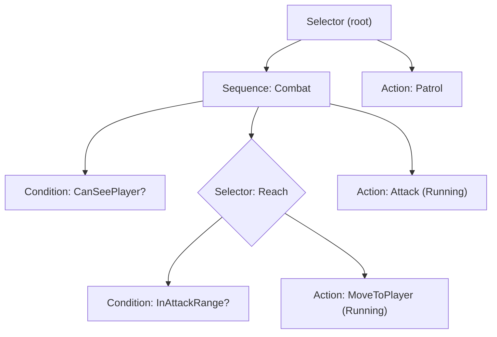

# Behavior Trees & Utility AI

Two complementary ways to structure NPC decision-making, plus how to combine them. A
**behavior tree (BT)** expresses *structured, prioritized, reactive* logic as a tree that is
"ticked" each step. **Utility AI** answers *"how much do I want each option right now?"* by
scoring actions with normalized curves and picking the best. Ship believable agents by using a
BT for structure and Utility AI where graded trade-offs matter.

This skill is the **implementation** companion to `game-ai` (which helps you *choose* between
FSM / BT / steering / pathfinding). Read `game-ai` to pick a model; read this to build the
runtime.

## When to use

- Use to build a **reusable BT runtime**: a `Blackboard`, `Node` base, action/condition leaves,
  `Sequence`/`Selector`/`Parallel` composites, and decorators (Inverter, Cooldown, Repeat).
- Use to build a **Utility AI** decider: response curves, considerations, and an evaluator that
  scores and selects actions (max, softmax, or weighted-random for variety).
- Use to build **hybrid AI** — a BT whose leaf delegates the "which attack / which target"
  choice to a utility evaluator.

**When *not* to use:** to *choose* between FSM, BT, steering, or pathfinding, and for A*/navmesh
routing, use `game-ai`. For Unreal's asset-based `BehaviorTree`/`Blackboard`, `BTTask`/`BTService`
and `AIController`, use `unreal-behavior-trees`. For the navmesh agent that *moves* the NPC, use
`unity-navmesh` or the engine's navigation node.

## Core workflow

1. **Pick the model.** Structured, prioritized, interruptible behavior → **BT**. Continuous
   "score every option" decisions (targeting, needs, item choice) → **Utility**. Both → **hybrid**.
2. **Design the Blackboard first.** One typed key/value store per agent is the shared memory that
   decouples nodes; leaves read/write it and never hold references to each other.
3. **Write leaves.** *Conditions* return `Success`/`Failure` immediately; *actions* return
   `Running` across frames until they finish. Keep leaves small and side-effect-explicit.
4. **Compose.** `Selector` = OR/fallback (first non-failure wins); `Sequence` = AND (stop at first
   non-success); `Parallel` for concurrent branches. Wrap with decorators for policy (invert,
   cooldown, repeat, force-success).
5. **For Utility:** enumerate considerations, map each raw fact through a **normalized 0..1 curve**,
   combine (weighted product with compensation, or weighted sum), then select the max — add
   hysteresis so agents don't flip-flop on ties.
6. **Tick deliberately.** Tick the tree/evaluator once per *decision step* (often slower than
   render). Preserve `Running` state between ticks; verify by drawing the active path and the
   per-action scores on screen while tuning.

## Architecture at a glance

A behavior tree evaluates top-down, left-to-right; each node returns a status up to its parent:



Utility AI is a scoring pipeline — every candidate action is scored, then one is selected:

```text
facts (distance, health, ammo…)
      │  each fact → a normalized 0..1 response curve (consideration)
      ▼
score(action) = weight · combine(consideration_1 … consideration_n)   # product+compensation or sum
      ▼
select: argmax  ·  or softmax / weighted-random for variety  ·  + hysteresis to avoid jitter
```

**Status is a three-value enum** shared by every node — this is the contract that makes the tree
composable:

```csharp
public enum Status { Success, Failure, Running }

public abstract class Node
{
    public abstract Status Tick(Blackboard bb, float dt);
    public virtual void Reset() { }   // called when a parent abandons this subtree
}
```

```csharp
// Selector = fallback/OR: return the first child that is not Failure.
public sealed class Selector : Composite
{
    public override Status Tick(Blackboard bb, float dt)
    {
        for (; _current < Children.Count; _current++)
        {
            var s = Children[_current].Tick(bb, dt);
            if (s != Status.Failure) return s;   // Success or Running stops the scan
        }
        _current = 0;
        return Status.Failure;                    // every child failed
    }
}
```

The reciprocal `Sequence` (AND — stop at first non-`Success`), `Parallel`, the `Blackboard`, the
leaf base classes, and every decorator are in `references/behavior-tree-core.md`.

## Utility scoring in one snippet

```csharp
// A consideration maps one raw fact to 0..1 through a response curve.
float Score(Blackboard bb)
{
    float distance01 = Curves.InverseLerp01(bb.Get<float>("distToPlayer"), 20f, 2f); // near = 1
    float health01   = Curves.Sigmoid(bb.Get<float>("health01"), k: 8f, mid: 0.4f);  // hurt = low
    // Product + compensation keeps a single 0 from vetoing while low values still dampen.
    return Curves.CompensatedProduct(new[] { distance01, health01 });
}
```

The full curve library (linear, quadratic, exponential, logistic/sigmoid, smoothstep), the
`Consideration`/`UtilityAction` types, and the `UtilityEvaluator` selection strategies are in
`references/utility-ai-system.md`.

## Pitfalls

- **Re-ticking a `Running` action from the root every frame restarts it.** Return `Running` and
  resume where you left off; only `Reset()` a subtree when a parent actually abandons it.
- **Deep trees re-evaluated wholesale each tick** waste time and cause thrash. Prefer shallow
  trees and *conditional aborts* (a higher-priority condition can interrupt a lower branch).
- **Un-normalized considerations.** If one curve outputs 0..100 and another 0..1, the big one
  dominates. Every consideration must return 0..1.
- **Utility jitter on near-ties.** Add hysteresis: give the currently-running action a small bonus
  so the agent commits instead of oscillating.
- **Allocating nodes, closures, or arrays every tick** creates GC spikes. Build the tree once at
  spawn; keep per-tick work allocation-free.

## References

- `references/behavior-tree-core.md` — Blackboard, `Node`/leaf base classes, action & condition
  leaves, `Sequence`/`Selector`/`Parallel`, and the decorator library (full C#).
- `references/utility-ai-system.md` — response-curve library, `Consideration`, `UtilityAction`,
  and the `UtilityEvaluator` (argmax, softmax, weighted-random, hysteresis).
- `references/practical-examples.md` — a guard Patrol→Combat BT, a villager needs-based Utility
  AI, and a hybrid agent, as drop-in templates.
- `references/best-practices-and-pitfalls.md` — memory management, profiling, avoiding deep trees,
  event-driven aborts, and combining Utility AI with BTs (hybrid architecture).

## Related skills

- `game-ai` — choose between FSM / BT / steering; A* and navmesh pathfinding.
- `unreal-behavior-trees` — Unreal's asset-based BT/Blackboard, tasks, decorators, services.
- `unity-navmesh` — the `NavMeshAgent` that carries out "move to" intents.
- `physics-tuning` — agent radius, movement, and collision response for the motion layer.
- `tower-defense`, `fps-shooter`, `rpg` — genres that compose this decision layer.
