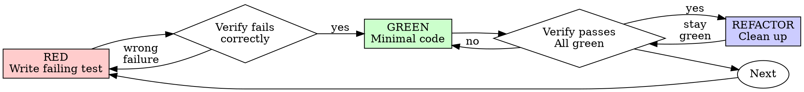

# Test-Driven Development (TDD)

## Overview

Write the test first. Watch it fail. Write minimal code to pass.

**Core principle:** If you didn't watch the test fail, you don't know if it tests the right thing.

**Violating the letter of the rules is violating the spirit of the rules.**

## When to Use

Use for behavior changes where a repeatable test can demonstrate the requirement or reproduce the bug. Inspect the repository’s test runner and existing coverage first. For copy, generated outputs or low-impact configuration, use the appropriate focused validation rather than manufacturing a unit test.

## Preserve existing work

Write the failing regression before the repair when feasible, and verify that it fails for the expected reason. If implementation already exists, preserve it and add characterization/regression tests. Do not delete user work, reset a branch or rewrite working code to reconstruct an ideal test-first history. State honestly whether the test preceded the fix.

## Red-Green-Refactor



### RED - Write Failing Test

Write one minimal test showing what should happen.

<Good>
```typescript
test('succeeds on the third attempt', async () => {
  let attempts = 0;
  const operation = async () => {
    attempts++;
    if (attempts < 3) throw new Error('fail');
    return 'success';
  };

  const result = await retryOperation(operation);

  expect(result).toBe('success');
  expect(attempts).toBe(3);
});
```
Clear name, tests real behavior, one thing
</Good>

<Bad>
```typescript
test('retry works', async () => {
  const mock = jest.fn()
    .mockRejectedValueOnce(new Error())
    .mockRejectedValueOnce(new Error())
    .mockResolvedValueOnce('success');
  await retryOperation(mock);
  expect(mock).toHaveBeenCalledTimes(3);
});
```
Vague name, tests mock not code
</Bad>

**Requirements:**
- One behavior
- Clear name
- Real code (no mocks unless unavoidable)

### Verify RED - Watch It Fail

**MANDATORY. Never skip.**

```bash
npm test path/to/test.test.ts
```

Confirm:
- Test fails (not errors)
- Failure message is expected
- Fails because feature missing (not typos)

**Test passes?** Determine whether it already characterizes the required behavior. For a regression, prove it detects the defect using the prior revision or an isolated controlled change; do not alter a correct assertion just to force red.

**Test errors?** Fix error, re-run until it fails correctly.

### GREEN - Minimal Code

Write simplest code to pass the test.

<Good>
```typescript
async function retryOperation<T>(fn: () => Promise<T>): Promise<T> {
  for (let i = 0; i < 3; i++) {
    try {
      return await fn();
    } catch (e) {
      if (i === 2) throw e;
    }
  }
  throw new Error('unreachable');
}
```
Just enough to pass
</Good>

<Bad>
```typescript
async function retryOperation<T>(
  fn: () => Promise<T>,
  options?: {
    maxRetries?: number;
    backoff?: 'linear' | 'exponential';
    onRetry?: (attempt: number) => void;
  }
): Promise<T> {
  // YAGNI
}
```
Over-engineered
</Bad>

Don't add features, refactor other code, or "improve" beyond the test.

### Verify GREEN - Watch It Pass

**MANDATORY.**

```bash
npm test path/to/test.test.ts
```

Confirm:
- Test passes
- Other tests still pass
- Output pristine (no errors, warnings)

**Test fails?** Fix code, not test.

**Other tests fail?** Fix now.

### REFACTOR - Clean Up

After green only:
- Remove duplication
- Improve names
- Extract helpers

Keep tests green. Don't add behavior.

### Repeat

Next failing test for next feature.

## Good Tests

| Quality | Good | Bad |
|---------|------|-----|
| **Minimal** | One thing. "and" in name? Split it. | `test('validates email and domain and whitespace')` |
| **Clear** | Name describes behavior | `test('test1')` |
| **Shows intent** | Demonstrates desired API | Obscures what code should do |

## Why order matters

A failing test can expose a misunderstood requirement before implementation. A test written after a fix can still be valuable, but its sensitivity to the original defect needs evidence. Neither timing nor coverage percentage proves the assertion is meaningful.

If a failure is caused by a missing import, unavailable service or bad fixture, repair that setup before interpreting the result. Use real boundaries where practical; a mock is useful when it isolates an external dependency while preserving the contract under test.

## Example: Bug Fix

**Bug:** Empty email accepted

**RED**
```typescript
test('rejects empty email', async () => {
  const result = await submitForm({ email: '' });
  expect(result.error).toBe('Email required');
});
```

**Verify RED**
```bash
$ npm test
FAIL: expected 'Email required', got undefined
```

**GREEN**
```typescript
function submitForm(data: FormData) {
  if (!data.email?.trim()) {
    return { error: 'Email required' };
  }
  // ...
}
```

**Verify GREEN**
```bash
$ npm test
PASS
```

**REFACTOR**
Extract validation for multiple fields if needed.

## Verification Checklist

Before marking work complete:

- [ ] Changed behavior and consequential failure paths have appropriate tests
- [ ] Regression sensitivity is demonstrated; timing of the test is reported honestly
- [ ] Each test failed for expected reason (feature missing, not typo)
- [ ] Wrote minimal code to pass each test
- [ ] All tests pass
- [ ] Output pristine (no errors, warnings)
- [ ] Tests use real code (mocks only if unavoidable)
- [ ] Edge cases and errors covered

Record any unmet check and its consequence. Do not erase work or claim an unobserved failure to complete a checklist.

## When Stuck

| Problem | Solution |
|---------|----------|
| Don't know how to test | Write wished-for API. Write assertion first. Ask your human partner. |
| Test too complicated | Design too complicated. Simplify interface. |
| Must mock everything | Code too coupled. Use dependency injection. |
| Test setup huge | Extract helpers. Still complex? Simplify design. |

## Debugging Integration

Bug found? Write failing test reproducing it. Follow TDD cycle. Test proves fix and prevents regression.

Prefer a reproducible regression for a bug fix; use another explicit verifier when a test cannot reasonably exercise the failure.

## Testing Anti-Patterns

When adding mocks or test utilities, read @testing-anti-patterns.md to avoid common pitfalls:
- Testing mock behavior instead of real behavior
- Adding test-only methods to production classes
- Mocking without understanding dependencies

## Inputs and expected result

You need the user-visible requirement, the current implementation, a known runner and a controlled fixture. In the empty-email example, the failure must be “missing validation”, not a network outage. Expected: the regression fails on the defective behavior and passes after the smallest repair, while existing valid submissions still work.

## Limitations

- A passing unit test does not prove browser, packaged-runtime or provider integration behavior.
- Retry examples assume retry-safe operations; production retries need explicit idempotency, cancellation and retryable-error policy.
- Test-first order does not prevent incorrect requirements or over-mocking. Inspect assertions and real boundaries.
- Preserve unrelated changes and use the project’s existing test commands rather than assuming every `npm test` accepts the same arguments.
